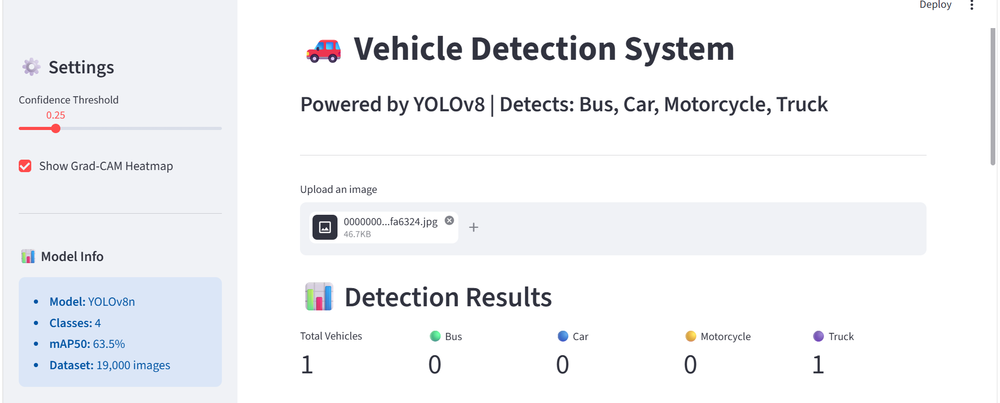
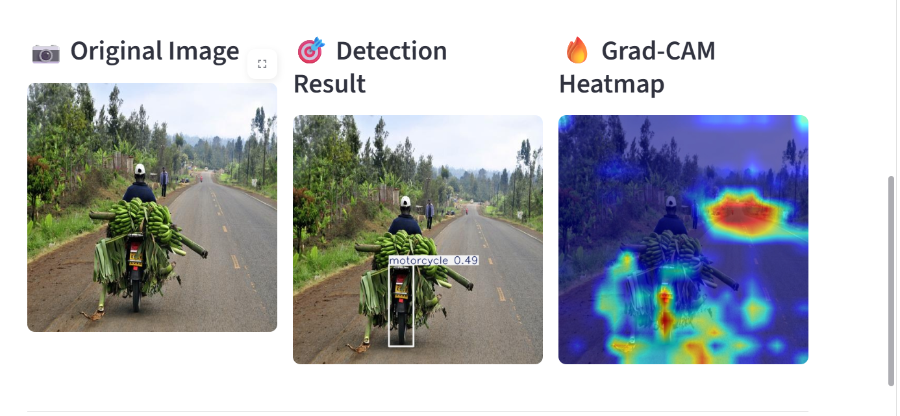
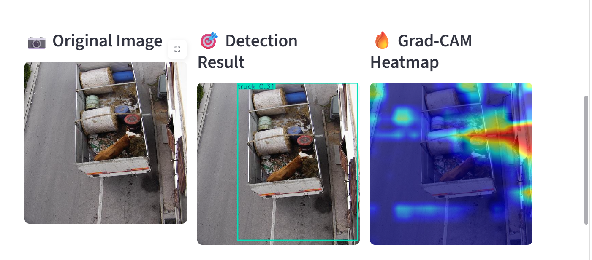

# 🚗 Vehicle Detection System using YOLOv8


A real-time vehicle detection system built with YOLOv8 and deployed as an interactive Streamlit web application. The system detects 4 types of vehicles with Grad-CAM explainability.

---

## 🎯 Demo



---

## 🔍 Detection Results




---

## ✨ Features

- ✅ Real-time vehicle detection using YOLOv8n
- ✅ Detects 4 classes: Bus, Car, Motorcycle, Truck
- ✅ Grad-CAM heatmap visualization
- ✅ Adjustable confidence threshold
- ✅ Detection statistics dashboard
- ✅ Detailed detection table

---

## 📊 Model Performance

| Class | mAP50 |
|---|---|
| Bus | 77.7% |
| Motorcycle | 64.1% |
| Car | 62.4% |
| Truck | 50.2% |
| **Overall** | **63.5%** |

---

## 🗃️ Dataset

- **Source:** Vehicles-COCO (Roboflow)
- **Total Images:** 18,998
- **Train:** 13,300 images
- **Valid:** 3,798 images
- **Test:** 1,900 images
- **Classes:** Bus, Car, Motorcycle, Truck

---

## 🧠 Model Details

| Parameter | Value |
|---|---|
| Model | YOLOv8n |
| Epochs | 20 |
| Image Size | 640x640 |
| Batch Size | 16 |
| Device | Tesla T4 GPU |
| Training Time | 1.5 hours |

---

## 🚀 How to Run

**1. Clone the repository:**
```bash
git clone https://github.com/Saniyakhannn/vehicle-detection-yolov8.git
cd vehicle-detection-yolov8
```

**2. Install dependencies:**
```bash
pip install -r requirements.txt
```

**3. Run the app:**
```bash
streamlit run app.py
```

**4. Open browser at:** `http://localhost:8501`

---

## 📁 Project Structure
vehicle-detection-yolov8/

├── app.py                 # Streamlit application

├── best.pt               # Trained YOLOv8 model

├── requirements.txt      # Dependencies

├── assets/               # Screenshots
│   ├── app_screenshot.png
│   ├── detection_motorcycle.png
│   └── detection_truck.png
└── README.md
---

## 🛠️ Tech Stack

- **Model:** YOLOv8n (Ultralytics)
- **Framework:** PyTorch
- **App:** Streamlit
- **Explainability:** Grad-CAM
- **Training:** Google Colab (Tesla T4 GPU)
- **Dataset:** Roboflow Universe

---

## 👩‍💻 Author

**Saniya Khan**
- GitHub: [@Saniyakhannn](https://github.com/Saniyakhannn)

---

## 📄 License

This project is licensed under the MIT License.
